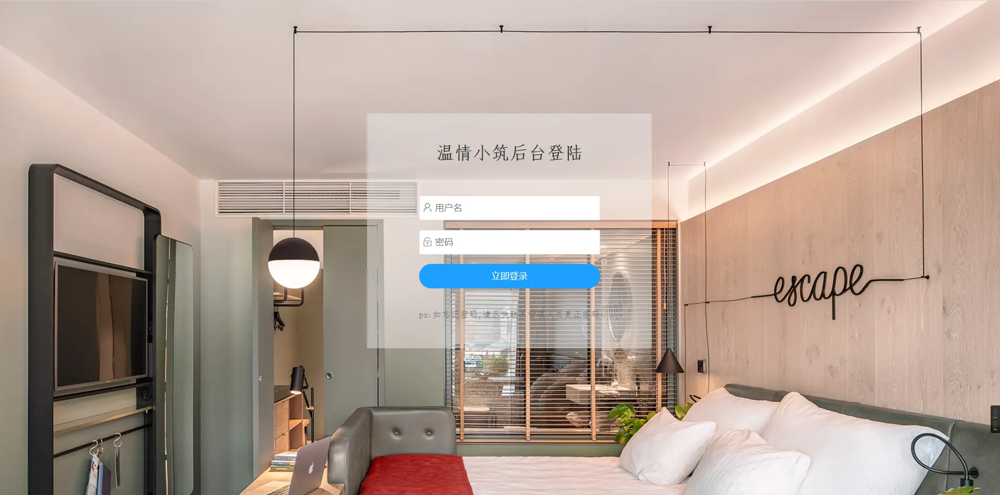
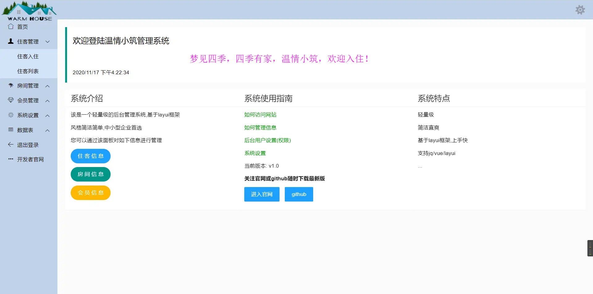
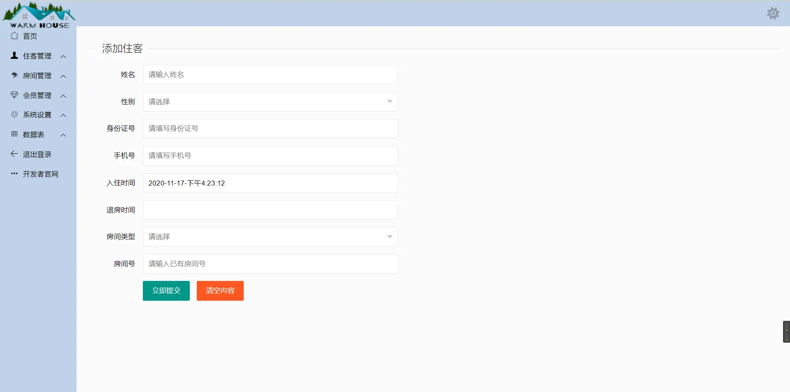
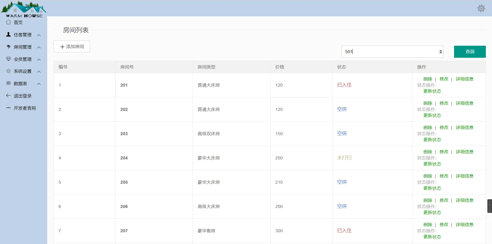

# 酒店管理信息系统

#### 介绍

一个精简的基于 SSM 框架开发的酒店管理信息系统，适用课程 Demo 或毕业设计，极简易读快速上手。

其主要功能包括对住客、房间和会员信息管理，同时可以下载房间及会员信息数据。

前端实现采用了传统 Layui-Qadmin 模板，整体简约大气，欢迎下载学习或二次开发。

#### 安装教程

1. 导入 IDE 工具，配置 Tomcat 服务器，上下文路径配置为：`/`
2. 修改 resources/properties/jdbc.properties 文件，配置数据库连接
3. 导入hotel.sql 数据库文件

> ps：JDK 版本 1.8、MySQL 版本 5.7 及以上、Tomcat 版本 8.0 及以上

#### 使用说明

1. 运行登陆

2. 左栏操作相应功能

#### 部分页面截图

1. 登录页
   
   
2. 首页
   
   
3. 添加信息
   
   
4. 列表展示
   
   

---
原 Gitee 仓库永久关闭，现此作为为主仓库，目前版本不在更新，后续有计划更新为 SpringBoot + Vue 前后端分离架构。